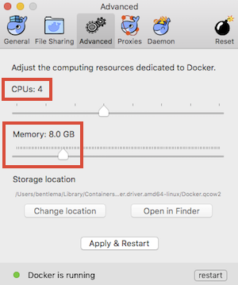

<-- [Back](/README.md#labs)

---

### **Lab #1** - Install software, and use Docker to deploy 3 training Containers

---

### Overview ###

Time to complete:  30 minutes

The following software should already be installed:

* **Git** - the version control system

In this lab you will install the following software:

* **Docker** - the container deployment tool

...and then create 3 containers named as follows:

1. **puppet**   (Puppet Master, PE Console, etc.)
3. **agent**    (A Puppet agent)
2. **gitlab**   (the Git Hosting Software)

### Download Software ###

* Download the needed software for this training...

From the top-level of the cloned repo, you'll find a script which will
download the necessary software...

```
     [puppet-tutorial-pe]$ cd share
     [puppet-tutorial-pe/share]$ cd software
     [puppet-tutorial-pe/share/software]$ ./download-all.sh
```

### Installing Docker ###

After running the **download-all.sh** Find the appropriate installer for
Mac or Windows in the **share/software/docker** folder.

```
     [puppet-tutorial-pe/share/software]$ cd docker
     [puppet-tutorial-pe/share/software/docker]$ ls -l

     total 426328
     -rw-r--r--  1 bentlema  staff  115214630 Aug 20 16:08 Docker.dmg
     -rw-r--r--  1 bentlema  staff  103059456 Aug 20 16:09 InstallDocker.msi
     -rwxr-xr-x  1 bentlema  staff        305 Aug 19 12:07 download-docker.sh

```

Open up a new Finder window (on Mac) or an Explorer window (on Windows) and navigate to the **share/software/docker** directory, and...

* On Mac OS X, double-click the **Docker.dmg**, and then double-click the installer
* On Windows double-click the **InstallDocker.msi** file to launch the installer
* If you're running Linux, Docker runs natively, so you just need to install the **docker-engine** package.
  See:  <https://docs.docker.com/engine/installation/linux/>

### Set Maximum Memory Usage

Docker utilizes a VM to run docker images in, and it needs to be told the maximum memory and virtual CPUs to use.
Open up the Docker Settings / Preferences, and under the Advanced Tab, change the number of vCPUs and Memory
to 4 CPUs and 8.0GB Memory.  If you dont do this, your Docker containers will begin to swap and appear to run
very slowly.




### Some Docker Basics ###

Here are some of the Docker commands you will be using.

```
     docker help     # see help page
     docker ps       # see running containers
     docker ps -a    # See all containers
     docker images   # show local docker images
     docker rmi      # remove an image
     docker run      # create and run a container
     docker exec     # run a command within an already running container
     docker stop     # stop a container
     docker rm       # remove a stopped container
     docker network  # create/destroy/list Docker networks
```

We will learn about these as we go along...

### Creating A Private Docker Network ###

Create a Docker Network.  It will be used by the 3 containers we create to communicate with eachother.

```
     docker network create --subnet=192.168.198.0/24 example.com
```

Note:  We name our network using what looks like a domain name because Docker
will use the network name in the **Fully-Qualified Domain Name** (FQDN) of the
container.  Docker's internal DNS server will take the short hostname and
append the network name when doing reverse-lookups (PTR records) so we do
this little hack to make sure the forward and reverse lookups match.  With
this said, I've seen inconsistant behavior with Docker's internal DNS, and
sometimes reverse lookups just dont work at all.  No matter, we push on!


### Setup environment variable with your BASEDIR ###

I don't know where you've cloned this puppet-tutorial-pe repo to on your
workstation.  So, let's make our lives simpler, and set an environment variable
to contain the absolute path to your working tree (top level of the repo)

Make sure your current working directory is the top level of the puppet-tutorial-pe
repo, and then just type this:

If using Windows:

   * Need to put instructions here for Windows users (but I dont own a Windows system to test on)
   * For now, if using Windows, you'll just have to type out the full absolute path where you see **${BASEDIR}** referenced below.

If using a bash shell (Linux or Mac OS X):

```
     export BASEDIR=$(pwd)
```

Then validate that BASEDIR is set to what you want:

```
     echo $BASEDIR
```

And you should see something like this:

```
     $ pwd
     /Users/bentlema/Puppet-Training/puppet-tutorial-pe

     $ export BASEDIR=$(pwd)

     $ echo $BASEDIR
     /Users/bentlema/Puppet-Training/puppet-tutorial-pe

```

Now, as you'll see in the following sections, we will use **${BASEDIR}** in the docker
command when specifying the absolute path to our volumes.  If you dont specify the
absolute path, the volume mapping will not work as expected.  So, rather than having
to type out the entire path each time, we save it in BASEDIR.


### Create and run your Puppet Master Container ###

To start up the container for the Puppet Master:

```
   docker run -d                         \
      --memory 4G                        \
      --net example.com                  \
      --ip 192.168.198.10                \
      -p 22022:22                        \
      -p 22443:443                       \
      -p 22080:8080                      \
      -p 22081:8081                      \
      -p 22140:8140                      \
      -p 22000:3000                      \
      --name puppet                      \
      --hostname puppet.example.com      \
      --dns-search=example.com           \
      --network-alias=puppet             \
      --network-alias=puppet.example.com \
      --volume ${BASEDIR}/share:/share   \
      bentlema/centos6-puppet-nocm       \
      /sbin/init
```

You will see someoutput like this:

```
Unable to find image 'bentlema/centos6-puppet-nocm:latest' locally
latest: Pulling from bentlema/centos6-puppet-nocm
b6d7b2ebc0a7: Pull complete
f8d0a70b3a37: Pull complete
3a45149aa462: Pull complete
ed8f8a2946b2: Pull complete
14dd1ef04b2a: Pull complete
7c6783c108f4: Pull complete
7d3711267225: Pull complete
c4e780c655e7: Pull complete
Digest: sha256:321205a84c4340f0d24b56cb8def669ac5e769704d8d26921ba9af039c290833
Status: Downloaded newer image for bentlema/centos6-puppet-nocm:latest
1e728f78568bf155963a222f4aee9524c82d32a524449908158d3b924e687d44
```

You've just started up your **puppet** container, and left it running in the background.

To see your running containers do:

```
     docker ps
```

### Login to the puppet container ###

```
     docker exec -it puppet /bin/bash
```

*OR*

```
     ssh -l root localhost -p 22022
```

The default password is:  *foobar23*


### Create and run your agent container ###

```
   docker run -d                        \
      --memory 512M                     \
      --net example.com                 \
      --ip 192.168.198.11               \
      -p 23022:22                       \
      --name agent                      \
      --hostname agent.example.com      \
      --dns-search=example.com          \
      --network-alias=agent             \
      --network-alias=agent.example.com \
      --volume ${BASEDIR}/share:/share  \
      bentlema/centos6-puppet-nocm      \
      /sbin/init
```

You've just started up your **agent** container, and left it running in the background.

To see your running containers do:

```
     docker ps
```

### Login to the agent container ###

```
     docker exec -it agent /bin/bash
```

*OR*

```
     ssh -l root localhost -p 23022
```

The default password is:  *foobar23*

### Create and run GitLab container ###

Notice that the container image we're using is from *gitlab* itself.  That's
the nice thing about Docker.  There are many pre-built container images
that we can just use, and instantly have a nice piece of software up and
running without any fuss.


```
   docker run --detach                   \
      --net example.com                  \
      --ip 192.168.198.12                \
      --publish 24022:22                 \
      --publish 24080:80                 \
      --publish 24443:443                \
      --name gitlab                      \
      --hostname gitlab.example.com      \
      --dns-search example.com           \
      --network-alias gitlab             \
      --network-alias gitlab.example.com \
      --env GITLAB_DATABASE_POOL="3;"    \
      --env GITLAB_OMNIBUS_CONFIG="gitlab_rails['db_pool'] = 3" \
      --volume "${BASEDIR}/gitlab/config:/etc/gitlab"   \
      --volume "${BASEDIR}/gitlab/logs:/var/log/gitlab" \
      --volume "${BASEDIR}/gitlab/data:/var/opt/gitlab" \
      gitlab/gitlab-ce:latest

```

Give GitLab a minute or two to configure itself, and then try connecting to the web GUI:

- GitLab Server: <http://127.0.0.1:24080/>

You will be prompted to set a new password, so go ahead and do that, and then login:

- Username: ***root***
- Password: ***\<the password you just set\>***

That's all we're going to do with GitLab for now.  We'll come back to it in a later lab...

---

At this point, all 3 of your Docker containers should be up and running.  Woot!

---

### Test network connectivity and name resolution between your containers ###

Before we continue, let's make sure we can communicate over the internal
Docker network we've created to/from each container.

Connect to your puppet and agent containers in 2 different terminal windows:

- `docker exec -it puppet /bin/bash`
- `docker exec -it agent /bin/bash`

From each, test that you can ping the other by name:

From the **puppet** container, ping the **agent** container using the short name:

```
     ping agent
```

You should see something like this:

```
     [root@puppet /]# ping agent
     PING agent (192.168.198.11) 56(84) bytes of data.
     64 bytes from agent.example.com (192.168.198.11): icmp_seq=1 ttl=64 time=0.140 ms
     64 bytes from agent.example.com (192.168.198.11): icmp_seq=2 ttl=64 time=0.118 ms
     64 bytes from agent.example.com (192.168.198.11): icmp_seq=3 ttl=64 time=0.093 ms
     64 bytes from agent.example.com (192.168.198.11): icmp_seq=4 ttl=64 time=0.117 ms
     ^C
     --- agent ping statistics ---
     4 packets transmitted, 4 received, 0% packet loss, time 3352ms
     rtt min/avg/max/mdev = 0.093/0.117/0.140/0.016 ms
```
Press **Control-C** to abort the continuous ping.

From the **agent** container, ping the **puppet** container using the short name:

```
     ping puppet
```

You should see something like this:

```
     [root@agent /]# ping puppet
     PING puppet (192.168.198.10) 56(84) bytes of data.
     64 bytes from puppet.example.com (192.168.198.10): icmp_seq=1 ttl=64 time=0.103 ms
     64 bytes from puppet.example.com (192.168.198.10): icmp_seq=2 ttl=64 time=0.137 ms
     64 bytes from puppet.example.com (192.168.198.10): icmp_seq=3 ttl=64 time=0.195 ms
     64 bytes from puppet.example.com (192.168.198.10): icmp_seq=4 ttl=64 time=0.114 ms
     ^C
     --- puppet ping statistics ---
     4 packets transmitted, 4 received, 0% packet loss, time 3276ms
     rtt min/avg/max/mdev = 0.103/0.137/0.195/0.036 ms
```
Press **Control-C** to abort the continuous ping.

Notice that when the ping command reports the hostname of the thing it's pinging, it shows the FQDN.
How did that happen?

The containers are configured to use Docker's internal DNS server, and it configures itself with
both **A**-records (forward) and **PTR**-records (reverse) for all containers that have been created.

Notice that the **/etc/resolv.conf** is configured with the following:

```
     [root@puppet /]# cat /etc/resolv.conf
     search example.com
     nameserver 127.0.0.11
     options ndots:0

```

This tells the resolver library to use **127.0.0.11** as the nameserver, which is Docker's internal DNS server.

Try doing some forward lookups to get the **A**-records:

```
     [root@puppet /]# dig puppet.example.com +short
     192.168.198.10

     [root@puppet /]# dig agent.example.com +short
     192.168.198.11

     [root@puppet /]# dig gitlab.example.com +short
     192.168.198.12
```

Try doing some reverse lookups to get the **PTR**-records:

```
     [root@puppet /]# dig -x 192.168.198.10 +short
     puppet.example.com.

     [root@puppet /]# dig -x 192.168.198.11 +short
     agent.example.com.

     [root@puppet /]# dig -x 192.168.198.12 +short
     gitlab.example.com.
```

If you get the same responses, you can be assured that DNS is working properly.

Note:  Testing these DNS lookups from a single container is sufficient, as
we're just querying the internal DNS server.  If it works from one container,
it will work the same from the others.

---

Okay, our training environment is all setup, and we're ready to start installing software...

---

Continue on to **Lab #2** --> [Prepare to Install Puppet Enterprise](02-Prep-to-Install-Puppet-Master.md#lab-2)

---

Copyright © 2016 by Mark Bentley

