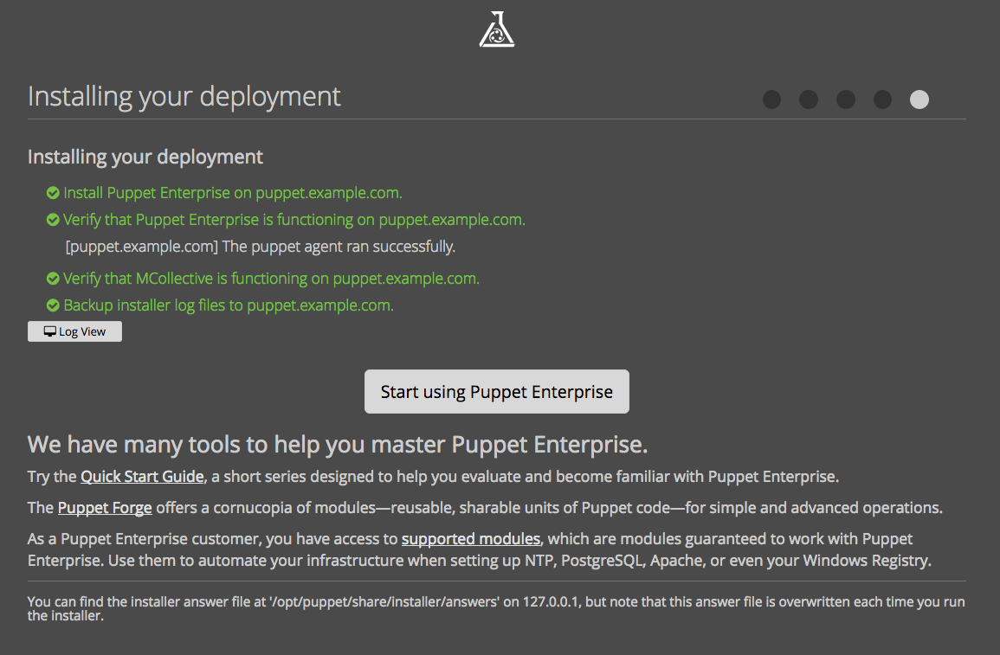

<-- [Back](02-Prep-to-Install-Puppet-Master.md#lab-2)

---

# **Lab #3** - Install Puppet Enterprise

---

### Overview ###

Time to complete:  30 minutes

In this lab we will install Puppet Enterprise 2016.5.1

* PE is free to install and evaluate
* When running PE without a license, you're limited to 10 agents

---

### Get logged in to your puppet Container ###

We are about to install Puppet Enterprise, so make sure you're
logged into our puppet master container.

### Note about root ###

If you're using Docker, and getting in to your container with an exec of bash,
you will already be the root user.  That's what we want...

### Run The Installer ###

Now let's un-compress/de-archive the PE installation tarball, and install...

Change into the directory with the PE software:

```shell
     cd /share/software/puppet
```
Note:  There are two different installation tarballs.  One for EL6 and one for EL7.

* If following the Docker track, we will use the EL6 tarball

```
     tar xzvf puppet-enterprise-2016.5.1-el-6-x86_64.tar.gz
     cd puppet-enterprise-2016.5.1-el-6-x86_64
```

Then run the installer:

```
     ./puppet-enterprise-installer
```

The installer will prompt you:

```
      How to proceed? [1]:
```

Press Enter to accept the default and then you'll see:

```
     Installing setup packages.
     Please go to https://puppet.example.com:3000 in your browser to continue installation.
     Be sure to use https:// and that port 3000 is reachable through the firewall.
```

Remember that we have **forwarded port 3000 to 22000** on our workstation, so...

* Use web browser to connect to: **<https://127.0.0.1:22000/>**
* Click **Monolithic Install**
* For FQDN, enter **puppet.example.com**
* For DNS alias, enter **puppet**
* Select: Install PostgreSQL on the PuppetDB host for me.
* Click **Submit**
* Click **Continue**

    Note:  Don't worry about the memory and disk space warnings.  The amount of memory and disk space we've provisioned will be just fine for this training exercise.

You will see this:

```
     We're checking to make sure the installation will work correctly
     Verify that 127.0.0.1 can resolve puppet.
     Verify root access on puppet.
     Verify that DNS is properly configured for puppet.
     Verify that your hardware meets requirements on puppet.
     Verify that 127.0.0.1 has a PE installer that matches puppet's OS.
     Verify that '/opt' and '/var' contain enough free space on puppet.
     [puppet] Insufficient space in '/opt' (16 GB); we recommend at least 100 GB for a production environment.
```

Click **Deploy Now**

```
     Intalling your deployment
     Install Puppet Enterprise on puppet.
     Verify that Puppet Enterprise is functioning on puppet.
     [puppet] The puppet agent ran successfully.
     Verify that MCollective is functioning on puppet.
     Backup installer log files to puppet.
```

During the installation process you may click on 'Log view' to see what is
happening behind the scenes, and then click 'Summary View' to return back to
the overview.



Note:  Once the installation completes, clicking the 'Start Using Puppet
Enterprise' button will **not** work, as we are port-forwarding from a
VM/Container to our localhost.  Use the link below instead.

---

### Login to the PE Console ###

We've forwarded port 443 from our puppet container to port 22443 on our hosting workstation, so you should be able to connect to the PE Console via the URL:

* PE Console URL:  **<https://127.0.0.1:22443/>**

Login as **admin** and enter the admin password you chose during the install.

If you forgot (or not sure what you typed) you can find the password in the answers file:

```
     grep console_admin_password /opt/puppetlabs/puppet/share/installer/conf.d/puppet.example.com.conf
```

Probabbly a good idea to **change it**...!

---

Believe it or not, that's all there is to installing a 'Monolithic' puppet
server.

Look around the PE console.  You should see 1 agent is registered called **puppet.example.com**.  This is your Puppet Master!

To change the 'admin' account password, click on 'admin' in the top right corner, and select 'My Account'.  You should
find a 'Reset password' link near the top/right of that page.

Test your PE install from the shell prompt by running the agent manually like this:

```
     puppet agent -t
```

Note:  Even on the Puppet Master, the Agent runs regularly.  The Master configures itself through Puppet.  Be aware, if you make
a puppet change that affects all nodes, you will be affecting the master config as well (e.g. a global change to /etc/hosts).
Do not disable the puppet agent on the master thinking that you're guarding against accidental changes that could break your
puppet infrastructure.  The agent runs on the master are required for mcollective key distribution (they get stored in the PuppetDB
and then installed on the other nodes of puppet infra via exported resources).  Also, there are certain configuration params
in the puppet.conf on the master that are managed by puppet itself.


```shell
     [root@puppet ~]# puppet agent -t
     Info: Retrieving pluginfacts
     Info: Retrieving plugin
     Info: Loading facts
     Info: Caching catalog for puppet
     Info: Applying configuration version '1452623722'
     Notice: Finished catalog run in 5.54 seconds
```

Not too exciting.  We have confirmed that the agent run succeeds, so we know the puppetmaster is up and running and able
to build a catalog for itself. Good.

If you're on a terminal that supports ANSI color, you'll notice that the text
is in **GREEN**.  If there are any puppet errors during a puppet run, those errors
would show up in **RED** text.

---

Continue to **Lab #4** --> [Install Puppet Agent on agent node, and do test puppet run](04-Install-Puppet-Agent.md#lab-4)

---

### Further Reading ###

These links are not needed for this Lab, but for reference here's the PE Install Guide at the PuppetLabs web site:

Quick Start Guide:  <https://docs.puppetlabs.com/pe/2016.5/quick_start_install_mono.html>

Detailed Install Guide:  <https://docs.puppetlabs.com/pe/2016.5/install_basic.html>

Split Install:   <https://docs.puppetlabs.com/pe/2016.5/install_pe_split.html>

LEI Install:   <https://docs.puppetlabs.com/pe/2016.5/install_multimaster.html>

---

<-- [Back to Contents](/README.md)

---

Copyright © 2016 by Mark Bentley

