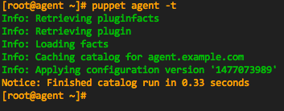

<-- [Back](03-Install-Puppet-Master.md#lab-3)

---

### **Lab #4** - Install the Puppet Agent

---

### Overview

Time to complete:  10-15 minutes

In this lab we will:

* Manually edit the /etc/hosts to prepare for the agent install (if not already done)
* Install the Puppet Agent on the **agent** node

### Pre-installation Steps

Make sure your **agent** VM is started, and get logged in.

```
     vagrant up agent
     vagrant ssh agent
```

### Edit the hosts file

Again, our `/etc/hosts` file should already be setup, as we've used a pre-configured
Vagrant base box that already has the entries we want, but for the sake of completness,
let's double check...

View and/or edit `/etc/hosts` and make sure it looks exactly like this (delete any other lines):
(This should be the exact same hosts file as we created on the **puppet** master node)

```
127.0.0.1      localhost
192.168.198.10 puppet.example.com puppet
192.168.198.11 agent.example.com  agent
192.168.198.12 gitlab.example.com gitlab
```

In a later lab we will write the puppet code to maintain the /etc/hosts entries,
but for now we add them manually.

### Install the Agent

To install the puppet agent on the **agent** node, we can take advantage of
a feature of the PE Master:  The PE Master makes available the agent installer
behind its own web server.  You can use **wget** or **curl** to download the
installer script and then pipe it through bash.

* To use **wget**

```
     wget --no-check-certificate --secure-protocol=TLSv1 -O - https://puppet:8140/packages/current/install.bash | bash -s main:certname=agent.example.com
```

* To use **curl**

```
     curl -k --tlsv1 https://puppet:8140/packages/current/install.bash | bash -s main:certname=agent.example.com
```

If you'd like to browse what else is accessible via that web server, try
opening <https://localhost:22140/packages> in your workstation's web browser.

(Remember we port-forwarded **8140** <--> **22140** on our hosting workstation)

Go ahead an install the agent if you haven't already done so, and then
try running the puppet agent...

* Puppet Install Output:  [04-Puppet-Agent-Install-Output.md](04-Puppet-Agent-Install-Output.md)


### Run the Puppet Agent

Run the puppet agent manually.  This will cause an SSL certificate request
to be generated and sent to the puppetmaster (if it hasn't already happened
in the background.)

```
     [root@agent ~]# puppet agent -t
     Info: Creating a new SSL key for agent.example.com
     Info: Caching certificate for ca
     Info: Caching certificate_request for agent.example.com
     Info: Caching certificate for ca
     Exiting; no certificate found and waitforcert is disabled
```

Note:  the puppet agent is also running in the background, so it may have already generated the SSL key,
so you may not see that in your output.  In that case, you would see just this:

```
[root@agent ~]# puppet agent -t
Exiting; no certificate found and waitforcert is disabled
```

### Sign the Certificate

Next, We need to sign the agent's cert on the master, so switch to your **puppet**
window/terminal and issue the following commands on the puppet master as root:

```
     puppet cert list
     puppet cert sign agent.example.com
```

The **puppet cert list** command shows any outstanding certificate signing requests.  You should see the one that was just generated by your agent run.

```
     [root@puppet ~]# puppet cert list
       "agent.example.com" (SHA256) 31:EA:4D:60:DE:44:E8:E1:A1:1A:2E:48:1E:81:CA:40:43:4A:A7:39:E8:B9:61:63:F3:0F:CF:2E:B7:CC:98:22
```

The **puppet cert sign agent.example.com** command signs the cert, and removes the signing request.

```
     [root@puppet ~]# puppet cert sign agent.example.com
     Notice: Signed certificate request for agent.example.com
     Notice: Removing file Puppet::SSL::CertificateRequest agent.example.com at '/etc/puppetlabs/puppet/ssl/ca/requests/agent.example.com.pem'
```

### Run puppet...

Now, back on the agent node:  Let's run puppet again (be sure you're running as root)

```
     puppet agent -t
```

You should see a lot of output to the screen showing the changes that are being applied.
(Puppet is installing and configuring MCollective on the agent.)
However, because puppet runs automatically in the background every 5 minutes prior to
its certificate being signed, there is a small chance that the first puppet run will
occur before you're able to do a manual run.  In that case, you should see a little output
as in the second puppet run (no changes made.)

### Run the Puppet Agent Again

Run puppet a **second** time, and you should get a clean run with no changes.

```
     puppet agent -t
```



For brevity, I've not included the output on this page, but it's available for viewing
here:

* Puppet Run Output:  [04-Puppet-Agent-Run-Output.md](04-Puppet-Agent-Run-Output.md)

### The Certname

The **certname** is the name assigned to the puppet agent.  It's how the puppet
master identifies each node.  Most of the time, the certname will be the same
as the host's FQDN, but it could be anything you choose.  Best practice is to
use the FQDN.

You may have noticed that when we installed the puppet agent, we passed in
an additional parameter using the `bash -s <key:value>` construct.  If you've
had any exposure to Puppet before, you may be asking yourself "Way did we have
to do that?"  The answer lies in how puppet determines the certname if you
dont provide one.  By default, puppet will take the hostname, and append the
domain name as configured in the /etc/resolv.conf.  We've not configured
the /etc/resolv.conf at all, and Vagrant automatically configures it to when
the VM is started up each time. It will inherit the DNS config from the host
system.  The inherited config will be different for everyone, and since the
agent installer would normally attempt to determine the **certname** from the
hostname and DNS domain, we don't want to rely on it here as we'd get
unpredictable results.  By manually specifying the certname, we guarantee we
will always get the name we want, rather than letting puppet try and pick
it for us.

There are other params we may wish to pass in to the install script as well.
You can pass in any config item that makes sense.  Just run `puppet config print`
to see the possibilities.

Also, to read more about passing parameters to the agent installer, see:  https://docs.puppet.com/pe/latest/install_agents.html#passing-configuration-parameters-to-the-install-script

### Summary

At this point we have:

- a **Puppet Master node** (hostname **puppet.example.com**) that also runs an agent to configure itself
- a **Puppet Agent node** (hostnamne **agent.example.com**) that runs an agent, and where we will test code and learn more about PE

If you login to the [PE Console](https://127.0.0.1:22443/), you should see these two agents on the 'Nodes' page

---

Continue to **Lab #5** --> [Get familiar with puppet config files, and puppet code, and CLI](05-Puppet-Config-and-Code.md#lab-5)

---

<-- [Back to Contents](/README.md)

---

Copyright © 2016 by Mark Bentley

