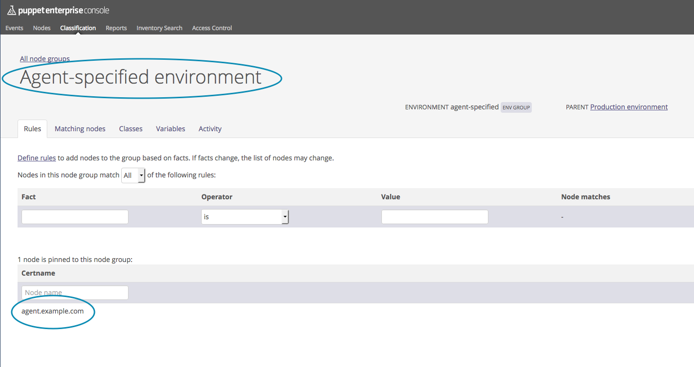

<-- [Back](07-Config-Hiera.md#lab-7)

---

### **Lab #8** - Environments

---

### Overview

Time to complete:  90 minutes

### Puppet Environments

We've already looked a little bit at puppet **environments** in
[Lab #5](05-Puppet-Config-and-Code.md), however we really haven't
talked about why you'd want to use them in too much detail.
Understanding environments and how puppet uses them will become very
important when we start to talk about R10K and Git in the coming labs.

So what exactly is a **Puppet Environment**?

PuppetLabs says this about environments:

>    A Puppet environment is an isolated set of Puppet manifests, modules, and data.
>
>    When a Puppet agent checks into a master and requests a catalog, it requests
>    that catalog from a specific environment.
>
>    Environments allow you to easily run different versions of Puppet code, so you
>    can test changes to that code without affecting all of your systems.

A Puppet Environment is just a container for puppet code.  You can have
multiple code trees for different sets of nodes.  Say you want all nodes of
**"Type A"** to use **"Code Tree A"** and all nodes of **"Type B"** to use
**"Code Tree B"**, you can do that with Puppet environments.

For example, imagine you are supporting two different customers with the
same PE infrastructure, and want to keep the code separate.

Or, imagine you want to create a temporary test environment to test some
code prior to promoting it up to the production environment.  This is a very
common use case, as we'll see...

A very useful way to envoke puppet from the command line is to
use the **double-dash-environment option**.  For example:

```
   puppet agent -t --environment=testing --noop
```

Even if the `puppet.conf` has `environment=production` in it, you can override
that by specifying an alternate environment from the command line.  This is
very useful if you have some test boxes that you want to test some new code
on.  In the above example we ran puppet against a **'testing'** environment, and
also specified **'--noop'** to ensure no changes are made to the host.  This way
we can see if the catalog compiles successfully, and if puppet wanted to make
the changes desired.

We're also going to introduce a new piece of software called **"R10K"**
(pronounced "Ar-Ten-Kay").  R10K will be coverd in a later lab along with
configuring a Git repository for our code.  For now, just know what R10K
does:  it simply pulls code from any number of Git repos, and drops it in
the correct location on your puppet master(s).  One useful feature of R10K
is that it maps every branch in the Git repo to a puppet environment.  So,
if you have a **'production'** branch in your Git repo, you will end up with a
**'production'** environment on your puppet master.  It's that simple.

Again, we will cover Git + R10K in a later lab.  I only introduce them breifly
here so that we can have the following discussion about **"Puppet Environments"**.
Going forward, I will simply write **environment** when talking about Puppet
Environments, as it gets old typing out **"Puppet Environemnts"** over and over.

### How to Use Puppet Environments

Again, we learned a little bit about environments and the `environment/`
directory structure in [Lab #5](05-Puppet-Config-and-Code.md), but we didn't
talk about when and why we'd use one.

There are at least a couple different ways to use environments.
The following two use cases are what I've seen out in the wild:

What I would call **"The Basic Use Case"** ...

  - All nodes are apart of the **production** environment (every `puppet.conf` would have `environment = production`)
  - New test environments are created by R10K dynamically, each environemnt corresponding to a Git branch (feature / temp branch)
  - These test environments are used to test code changes on a test node (could be a non-critical prod node, or a dedicated test node)
  - The tested code (that passed) would then be merged in to the production branch, and end up in the production environment via an R10K pull
  - At this point the new/changed code would be live in the production environment, and applied to all puppet-managed nodes
  - Delete the test (feature) branch in Git
  - Next time R10K runs, it would remove that test environemnt from the code tree on the master

So in the above use case, in addition to the "master" **production** environment, we may have
other puppet environments that are created dynamically on-the-fly by R10K.  In Git, they would be
short-lived feature branches that we introduce just for testing a new feature, or making a code
change. We'd test our changes on a non-production system, and once all bugs have been worked out,
we'd merge our feature branch in to the production branch.

What I would call **"The Multi-Customer Use Case"** ...

If your company has one team that supports multiple customers, you might very
well have one environemnt per customer.  The workflow would be identical to
the above **"Basic Use Case"** except you would have multiple production environments,
one for each customer.  The group that maintains the puppet infrastructure,
doesn't necessarily have to own the code in each of these environments either.

  1. internal_customer_A
  2. internal_customer_B
  3. internal_customer_C
  4. etc.

The internal customers might be different groups, or different divisions within
the same company.  All of these environments would still be "production"
environments.  They might be named something like:

  1. customer_A_prod
  2. customer_B_prod
  3. customer_C_prod
  4. etc.

Having separate environemnts like this, and using R10K, gives the ability to
have different groups maintain the code for each environemnt.  Depending on
the Git server you use, and the access controls available, you could even
restrict one environemnt to certain individuals (perhaps ones that signed
an NDA) within a group, and restrict a different environemnt to different
individuals within the same team.  Once we cover Git + R10K in more depth,
this will all start to make sense.

The above 2 use cases for environemnts are what I've seen used at the
companies I've worked at.  In fact, both use cases have been used simultaneously.

### Know the vocabulary and how different folks use it

There is the potential for some confusion when deciding how to build a new
puppet infrastructure for your company.  Every company is going to have
some vocabulary that is used around the shop regularly, and folks are
going to have an understanding of certain words that might only make
sense at that company.  One such word is **"environment"**.

One company might use names like "Lab Environment" or "Prod Environment",
etc., while another company might refer to their "Private Cloud Environment",
or "Hybrid Cloud Environemnt", etc.  It's very common for a Dev Shop to
have "environments" like:

  1. Development
  2. Integration
  3. Staging
  4. Production

...but are they really environments?  Maybe.  Do they correspond to different
sets of servers?  Or are they simply different branches in a Git repo?  You
have to remember, what are we using Puppet to manage?  Sets of servers. Do
these "Development Environments" match up to different sets of servers with
different config for each?  Probably not entirely.  You might see some
integration servers that QA/Test folks run their test on.  You might see
some staging servers where UAT is done.  But the important thing to keep in
mind is what servers/nodes you're managing, and how the configuration will
be different for each set.

Example:  A SaaS company that is releasing a Web/Java app every month
may have their Integration, Staging, and Production servers.  All of
these servers are identical with the exception of the users that are
allowed to login to them.  Do you need to create entirely separate
environments just to deal with authentication?  Probably not.

Do you need to be able to upgrade a puppet module and test it first
in the integration and/or staging environments first, before promoting
to production?

You really have to attack this issue from the perspective of what data
you want to manage, and what your workflow will be.  It's not a simple
answer.  It's probably the most difficult question to answer when you're
in the position of designing your Puppet infrastructure from scratch.

What I'd suggest is keep it simple, and then modify your puppet code
as needed to acomodate a new use case.  Do your best to predict how
you need Puppet to support your existing infrastructure, but keep in
mind there's more than one way to do things. (E.g. use a custom Hiera
data key to assign an application tier, division, workgroup, etc.,
and make decisions in your profile code based on that, rather than
abusing the puppet environments feature.)

From my own experience, I prefer the "Basic Use Case" I outlined above.
I've used it at multiple companies, and it works well.  I would advise
against using "static environments" that matches your development code
flow (Dev, Int, Stg, Prod).  As you'll see later on, having long-lived
branches in Git can cause you some **"Merge Agnst"**, if for example
you want to maintain permanent differences between each branch.

### Let's do something with Puppet Environments

Okay, so we've talked a lot about environments, but we haven't actually
done anything to show how they work.  So let's get our hands dirty
and try playing around with these environment things...

Remember that we manually created the **"development"** environment
in a previous Lab?  Well, let's try to run puppt against it on our
**agent** node:

```
[root@agent ~]# puppet agent -t --environment=development --noop
Warning: Local environment: "development" doesn't match server specified node environment "production", switching agent to "production".
Info: Retrieving pluginfacts
Info: Retrieving plugin
Info: Loading facts
Info: Caching catalog for agent.example.com
Info: Applying configuration version '1477337483'
Notice: /Stage[main]/Main/Notify[Location is: amsterdam]/message: current_value absent, should be Location is: amsterdam (noop)
Notice: Class[Main]: Would have triggered 'refresh' from 1 events
Notice: Stage[main]: Would have triggered 'refresh' from 1 events
Notice: Finished catalog run in 10.24 seconds
```

We got a warning!

```
Warning: Local environment: "development" doesn't match server specified node environment "production", switching agent to "production".
```

So how are we suposed to implement the code/dev/test/promote workflow we
presented previously?

There's a couple ways we can approach this:

1. Add our **agent.example.com** node to the **"Agent-specified environment"** node group via the PE Console
2. Disable the PE Console as the node classifier entirely

For the purposes of this example, we will go with option 1.


### Add node to Agent-specified environment node group

Let's do this:

1. Get logged into the PE console as the admin user.
2. Click on **Nodes** in the left-sidebar
2. Click on **Classification** sub-category
3. Drill into the **Production environment**
3. Click on **"Agent-specified environment"**
4. In the bottom section where you see **"Certname"** click and select **agent.example.com**
5. On the right, click **Pin Node**
6. Then in the bottom right corner, click **Commit**

That's all there is to it!  Your node **agent.example.com** will now be able to either specify its environment in its `puppet.conf` or from the command line, and the Puppet Master will gladly accept it.



Go ahead and try running puppet against the development environment again...

```
     [root@agent ~]# puppet agent -t --environment=development
     Info: Using configured environment 'development'
     Info: Retrieving pluginfacts
     Info: Retrieving plugin
     Info: Loading facts
     Info: Caching catalog for agent.example.com
     Info: Applying configuration version '1479250438'
     Notice: Applied catalog in 0.57 seconds
```

It worked just fine!

But, remember that all of the code changes we made previously to manage the
hosts file, ntp and timezone config, is only in the production environment,
so when we run against the development environment, none of those things will
be enforced.  Give it a try by making a change to the /etc/hosts file, then
running puppet against the development environment, and note that nothing
happened to revert your change.  This is exactly what we'd expect.

### Our Development Environment

What if we want to introduce a new module in to our development environment,
but not production?

Take a look at what modules are already installed:

```
[root@puppet ~]# puppet module list --environment=development

/etc/puppetlabs/code/environments/development/modules
└── puppetlabs-stdlib (v4.9.1)
/etc/puppetlabs/code/modules
└── puppetlabs-stdlib (v4.12.0)
/opt/puppetlabs/puppet/modules
├── puppetlabs-pe_accounts (v2.0.2-6-gd2f698c)
├── puppetlabs-pe_concat (v1.1.2-7-g77ec55b)
├── puppetlabs-pe_console_prune (v0.1.1-9-gfc256c0)
├── puppetlabs-pe_hocon (v2016.2.0)
├── puppetlabs-pe_infrastructure (v2016.4.0)
├── puppetlabs-pe_inifile (v2016.2.1-rc0)
├── puppetlabs-pe_java_ks (v1.2.4-37-g2d86015)
├── puppetlabs-pe_nginx (v2016.4.0)
├── puppetlabs-pe_postgresql (v2016.2.0)
├── puppetlabs-pe_puppet_authorization (v2016.2.0-rc1)
├── puppetlabs-pe_r10k (v2016.2.0)
├── puppetlabs-pe_razor (v1.0.0)
├── puppetlabs-pe_repo (v2016.4.0)
├── puppetlabs-pe_staging (v2015.3.0)
└── puppetlabs-puppet_enterprise (v2016.4.0)
```

Notice that we already have the **puppetlabs-stdlib** installed (v4.9.1) in
the development environment.  Let's install another module in the development
environment only.

The **message of the day** module is very simple, so let's test it out.

It can be found on the **Puppet Forge** here:  https://forge.puppet.com/puppetlabs/motd/readme

Install it on your puppet master for the development environment only, as follows:

```
[root@puppet ~]# puppet module install --environment development puppetlabs/motd
Notice: Preparing to install into /etc/puppetlabs/code/environments/development/modules ...
Notice: Downloading from https://forgeapi.puppetlabs.com ...
Notice: Installing -- do not interrupt ...
/etc/puppetlabs/code/environments/development/modules
└─┬ puppetlabs-motd (v1.4.0)
  └─┬ puppetlabs-registry (v1.1.3)
    └── puppetlabs-stdlib (v4.9.1)
```

Okay, the puppetlabs-motd module has been installed in our development environment.

Take a look at the /etc/motd file on your agent node just to see what it contains out of the box:

```
[root@agent ~]# ls -al /etc/motd
-rw-r--r--. 1 root root 0 Jun  7  2013 /etc/motd
[root@agent ~]# cat /etc/motd
```

Nothing!  It's just an empty file.  Okay then, let's use our new module to create our motd.

To tell puppet to apply that module to our agent node, we need to classify it.  Let's copy over
the various files we've already created in the production environment to get us started, and 
we'll modify things from there...

```
[root@puppet manifests]# cd /etc/puppetlabs/code/environments/
[root@puppet environments]# cp -r production/hieradata development/
[root@puppet environments]# cp -r production/manifests/ development/
[root@puppet environments]# chown -R pe-puppet:pe-puppet development
[root@puppet environments]# chmod a+rX development

```

Okay, now we have all of the Hiera data and puppet code that we created for the production environment sitting in the development environment as well.

Now run puppet on the agent node and see what happens:

```
[root@agent ~]# puppet agent -t --environment development
Info: Using configured environment 'development'
Info: Retrieving pluginfacts
Info: Retrieving plugin
Info: Loading facts
Error: Could not retrieve catalog from remote server: Error 500 on SERVER: Server Error: Evaluation Error: Error while evaluating a Function Call, Could not find class ::ntp for agent.example.com at /etc/puppetlabs/code/environments/development/manifests/site.pp:42:1 on node agent.example.com
Warning: Not using cache on failed catalog
Error: Could not retrieve catalog; skipping run

```

Why did we get an error?

Remember that when we installed the **ntp** and **timezone** modules, we only installed them for the production environment.
Do you remember why that is?  Because puppet will install modules, by default, in the **first element of the modulepath.**

```
[root@puppet environments]# puppet config print modulepath
/etc/puppetlabs/puppet/environments/production/modules
```

Take a peek again at where the ntp and timezone modules are installed:

```
     [root@puppet environments]# puppet module list --environment=production
     /etc/puppetlabs/code/environments/production/modules
     ├── puppetlabs-ntp (v6.0.0)
     ├── puppetlabs-stdlib (v4.13.1)
     └── saz-timezone (v3.3.0)
     /etc/puppetlabs/code/modules
     └── puppetlabs-stdlib (v4.12.0)
     [snip]
```
Confirm that you do not see the ntp and timezone modules in the development:

```
     [root@puppet environments]# puppet module list --environment=development
     /etc/puppetlabs/code/environments/development/modules
     ├── puppetlabs-motd (v1.4.0)
     ├── puppetlabs-registry (v1.1.3)
     └── puppetlabs-stdlib (v4.9.1)
     /etc/puppetlabs/code/modules
     └── puppetlabs-stdlib (v4.12.0)
     [snip]
```

Okay, at this point we have a couple choices to fix our puppet run:

1. Un-classify the ntp and timezone modules for the agent node
2. Install those modules in the development environment

Let's just install the modules:

```
     [root@puppet environments]# puppet module install --environment development puppetlabs/ntp
     Notice: Preparing to install into /etc/puppetlabs/code/environments/development/modules ...
     Notice: Downloading from https://forgeapi.puppetlabs.com ...
     Notice: Installing -- do not interrupt ...
     /etc/puppetlabs/code/environments/development/modules
     └─┬ puppetlabs-ntp (v6.0.0)
       └── puppetlabs-stdlib (v4.9.1 -> v4.13.1)

     [root@puppet environments]# puppet module install --environment development saz-timezone
     Notice: Preparing to install into /etc/puppetlabs/code/environments/development/modules ...
     Notice: Downloading from https://forgeapi.puppetlabs.com ...
     Notice: Installing -- do not interrupt ...
     /etc/puppetlabs/code/environments/development/modules
     └─┬ saz-timezone (v3.3.0)
       └── puppetlabs-stdlib (v4.13.1)

     [root@puppet environments]# puppet module list --environment=development
     /etc/puppetlabs/code/environments/development/modules
     ├── puppetlabs-motd (v1.4.0)
     ├── puppetlabs-ntp (v6.0.0)
     ├── puppetlabs-registry (v1.1.3)
     ├── puppetlabs-stdlib (v4.13.1)
     └── saz-timezone (v3.3.0)
     /etc/puppetlabs/code/modules
     └── puppetlabs-stdlib (v4.12.0)
     [snip]
```

Okay, they're installed, so let's try our puppet run again:

```
[root@agent ~]# puppet agent -t --environment=development
Info: Using configured environment 'development'
Info: Retrieving pluginfacts
Info: Retrieving plugin
Notice: /File[/opt/puppetlabs/puppet/cache/lib/facter/facter_dot_d.rb]/content:
[snip]
Info: Loading facts
Info: Caching catalog for agent.example.com
Info: Applying configuration version '1479251399'
Notice: Location is: amsterdam
Notice: /Stage[main]/Main/Notify[Location is: amsterdam]/message: defined 'message' as 'Location is: amsterdam'
Notice: Applied catalog in 0.75 seconds
```

Great, no errors!

Now, let's proceed to classify our node to use the **motd** module...

```
[root@puppet environments]# pwd
/etc/puppetlabs/code/environments
[root@puppet environments]# cd development/hieradata/node/
[root@puppet node]# vi agent.example.com.yaml
```

Edit the `agent.example.com.yaml` Hiera data to look like:

```
---

location: 'amsterdam'

classes:
   - ntp
   - timezone
   - motd

timezone::timezone: 'US/Pacific'
```

Now run puppet again...

```
     [root@agent ~]# puppet agent -t --environment=development
     Info: Using configured environment 'development'
     Info: Retrieving pluginfacts
     Info: Retrieving plugin
     Notice: /File[/opt/puppetlabs/puppet/cache/lib/puppet/provider/registry_key]/ensure: created
     Notice: /File[/opt/puppetlabs/puppet/cache/lib/puppet/provider/registry_key/registry.rb]/ensure: defined content as '{md5}5c26c6cbb1669a01361e69fadbbb408d'
     Notice: /File[/opt/puppetlabs/puppet/cache/lib/puppet/provider/registry_value]/ensure: created
     Notice: /File[/opt/puppetlabs/puppet/cache/lib/puppet/provider/registry_value/registry.rb]/ensure: defined content as '{md5}92b54f65f5be3c130681cbb04b216e09'
     Notice: /File[/opt/puppetlabs/puppet/cache/lib/puppet/type/registry_key.rb]/ensure: defined content as '{md5}bcf74b3a991cafdae54514b3c3c4a38c'
     Notice: /File[/opt/puppetlabs/puppet/cache/lib/puppet/type/registry_value.rb]/ensure: defined content as '{md5}140295468b773a7ad709a532e496005c'
     Notice: /File[/opt/puppetlabs/puppet/cache/lib/puppet_x]/ensure: created
     Notice: /File[/opt/puppetlabs/puppet/cache/lib/puppet_x/puppetlabs]/ensure: created
     Notice: /File[/opt/puppetlabs/puppet/cache/lib/puppet_x/puppetlabs/registry]/ensure: created
     Notice: /File[/opt/puppetlabs/puppet/cache/lib/puppet_x/puppetlabs/registry.rb]/ensure: defined content as '{md5}e81ba7665aedbd5cb519d75a4a8dbbd2'
     Notice: /File[/opt/puppetlabs/puppet/cache/lib/puppet_x/puppetlabs/registry/provider_base.rb]/ensure: defined content as '{md5}7d511743b5cec6b375b684b88396838a'
     Info: Loading facts
     Info: Caching catalog for agent.example.com
     Info: Applying configuration version '1479251540'
     Notice: Location is: amsterdam
     Notice: /Stage[main]/Main/Notify[Location is: amsterdam]/message: defined 'message' as 'Location is: amsterdam'
     Notice: /Stage[main]/Motd/File[/etc/motd]/content:
     --- /etc/motd    2013-06-07 07:31:32.000000000 -0700
     +++ /tmp/puppet-file20161115-9822-o29juw    2016-11-15 15:12:22.973018511 -0800
     @@ -0,0 +1,3 @@
     +The operating system is CentOS
     +The free memory is 200.24 MiB
     +The domain is example.com

     Notice: /Stage[main]/Motd/File[/etc/motd]/content: content changed '{md5}d41d8cd98f00b204e9800998ecf8427e' to '{md5}a6ecca768e0149d03268b441b9774863'
     Notice: Applied catalog in 0.80 seconds
```

It did something!

Let's take a look at the contents of the motd file again...

```
[root@agent ~]# cat /etc/motd
The operating system is CentOS
The free memory is 200.24 MiB
The domain is example.com
```

Okay, now we see that the motd module wrote new content within the /etc/motd file.

What if we want to customize how our motd looks?

```
[root@puppet node]# cd /etc/puppetlabs/code/environments/development/modules/motd/templates
[root@puppet templates]# ls -al
total 12
drwxr-xr-x 2 pe-puppet pe-puppet   36 Nov 15 14:56 .
drwxr-xr-x 6 pe-puppet pe-puppet 4096 Jan 26  2016 ..
-rw-r--r-- 1 pe-puppet pe-puppet  146 Jan 26  2016 motd.erb
-rw-r--r-- 1 pe-puppet pe-puppet   24 Jan 26  2016 spec.erb

[root@puppet templates]# vi motd.erb
```

Let's edit the template to look like this:

```
###########################################################################

     OS Distro: <%= @operatingsystem %> <%= @operatingsystemrelease %>

     MEMORY:
          Total: <%= @memory['system']['total'] %>
      Available: <%= @memory['system']['available'] %>
      Swap used: <%= @memory['swap']['used'] %>

     <%- if @domain -%>
     My domain is <%= @domain %>
     <%- end -%>
     My location is: <%= @location %>

###########################################################################

```

This is the first time we've seen a template.  A template is simply a text file
that is pre-processed before being deployed to the agent node.  We'll talk more
about the ERB template syntax in a later lab.

Now, save your template, and run puppet again:

```
[root@agent ~]# puppet agent -t --environment=development
Info: Using configured environment 'development'
Info: Retrieving pluginfacts
Info: Retrieving plugin
Info: Loading facts
Info: Caching catalog for agent.example.com
Info: Applying configuration version '1479253813'
Notice: Location is: amsterdam
Notice: /Stage[main]/Main/Notify[Location is: amsterdam]/message: defined 'message' as 'Location is: amsterdam'
Notice: /Stage[main]/Motd/File[/etc/motd]/content:
--- /etc/motd    2016-11-15 15:50:07.451576603 -0800
+++ /tmp/puppet-file20161115-11572-vzevz9    2016-11-15 15:50:16.274392880 -0800
@@ -0,0 +1,14 @@
+###########################################################################
+
+     OS Distro: CentOS 7.2.1511
+
+     MEMORY:
+          Total: 489.03 MiB
+      Available: 200.29 MiB
+      Swap used: 18.31 MiB
+
+     My domain is example.com
+     My location is: amsterdam
+
+###########################################################################
+

Notice: /Stage[main]/Motd/File[/etc/motd]/content:

Notice: /Stage[main]/Motd/File[/etc/motd]/content: content changed '{md5}d41d8cd98f00b204e9800998ecf8427e' to '{md5}ed131fae16df0e72f1a6144d053fa6cd'
Notice: Applied catalog in 0.78 seconds
```

Notice that your /etc/motd has been updated with the new content.

So how does this help us understand environments?

Notice that the **puppetlab-motd** module is only installed in the development
environment, so we're able to test it out without affecting the production
environment.

Now that we've tested our new module, and are confident that it works the way
we want, how would we promote it to production?

We'd need to:

1.  Make sure the module that we've tested against is also installed in production
2.  Classify nodes that we want to receive the motd

Since we've not yet introduced Git, we do this manually simply by installing the module
manually on the master (just as we have been doing), and then either copying or editing
the Hiera data in the production environemnt.  As you can see, this will get very
cumbersome very quickly, and why we want to be using a version control system such as Git.
We will setup a Git server and learn more about Git in the next lab, but for now, let's
go through the process of getting our new motd module and template activated within the
production environment:

```
[root@puppet puppet]# puppet module install --environment production puppetlabs/motd
Notice: Preparing to install into /etc/puppetlabs/puppet/environments/production/modules ...
Notice: Downloading from https://forgeapi.puppetlabs.com ...
Notice: Installing -- do not interrupt ...
/etc/puppetlabs/puppet/environments/production/modules
└─┬ puppetlabs-motd (v1.4.0)
  └─┬ puppetlabs-registry (v1.1.3)
    └── puppetlabs-stdlib (v4.13.1)
```

Next, let's copy over our template:

```
[root@puppet ~]# cd /etc/puppetlabs/code/environments
[root@puppet environments]# cp development/modules/motd/templates/motd.erb production/modules/motd/templates/motd.erb
cp: overwrite ‘production/modules/motd/templates/motd.erb’? y
```

Next, edit our Hiera data to classify all nodes...

```
[root@puppet environments]# cd production/hieradata
[root@puppet hieradata]# vi common.yaml
```

Let's classify all nodes to use this motd in our common.yaml

```
---

classes:
   - common_hosts
   - common_packages
   - motd

ntp::servers:
   - '0.pool.ntp.org'
   - '1.pool.ntp.org'
   - '2.pool.ntp.org'
   - '3.pool.ntp.org'

```

Run puppet on both the **puppet** master and the **agent** node, and you should see the /etc/motd get updated.

### Wrapping it up

We've seen how we can use two environments to test a new module, and then promote the code changes from one
to the other (development to production in this case).  We've also seen how cumbersome and prone to error it
can be with many manual steps of editing and copying files from one environment to the other.

In the following labs we will see how we can use a Git Hosting server called **GitLab** along with **R10K**
to automate the whole workflow, and make it way more fun!

---

Continue on to **Lab #9** --> [Install GitLab](09-Install-GitLab.md)

---

### More Reading

Gary Larizza did a nice write-up on this issue here:  <http://garylarizza.com/blog/2014/03/26/random-r10k-workflow-ideas/>

Gary Larizza Video Presentation:  <https://puppetlabs.com/webinars/git-workflow-best-practices-deploying-r10k>

Here's a PuppetLabs write-up, though a bit outdated (pre-R10K), there are a lot of interesting comments at the end:   <https://puppetlabs.com/blog/git-workflow-and-puppet-environments>

Here's the PuppetLabs write-up including R10K in the workflow:  <https://puppetlabs.com/blog/git-workflows-puppet-and-r10k>

---

<-- [Back to Contents](/README.md)

---

Copyright © 2016 by Mark Bentley

